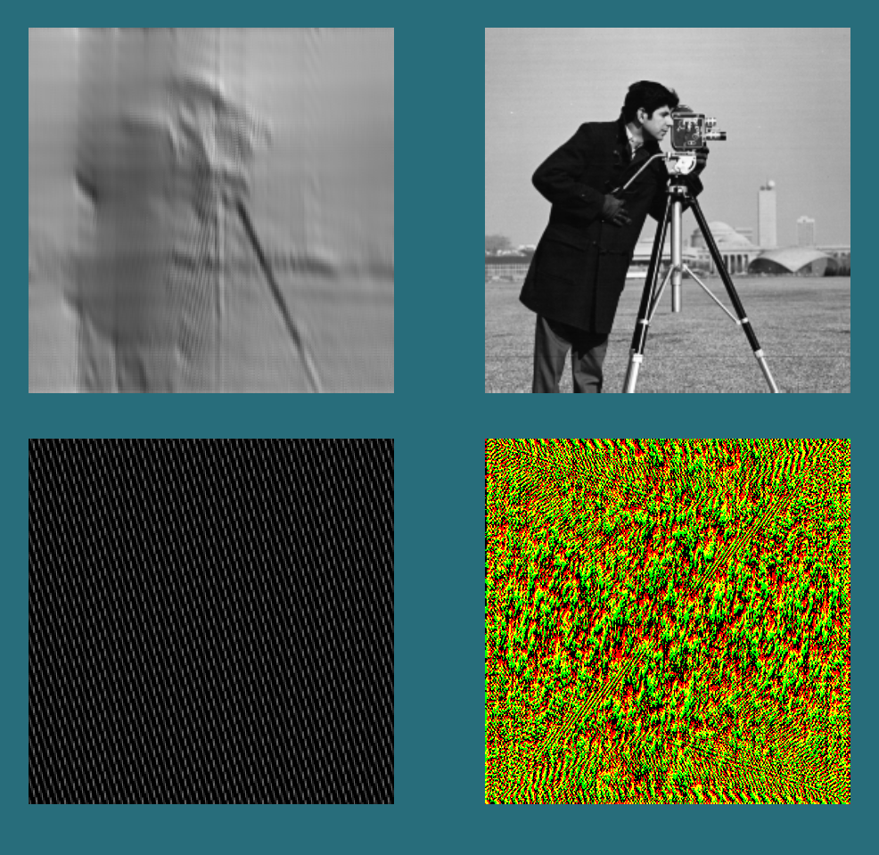
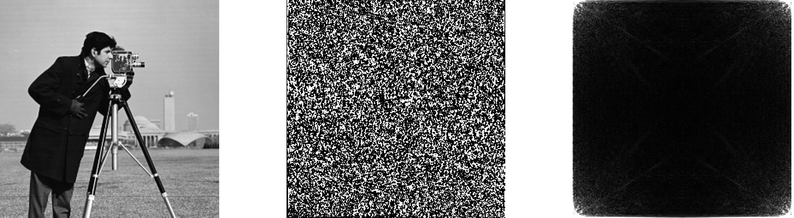
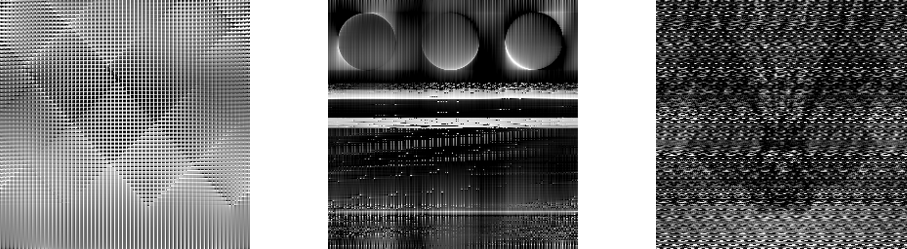
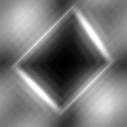
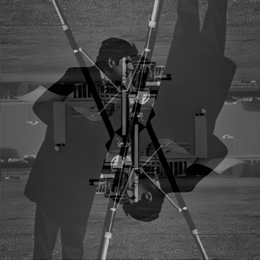

<h1>2D Parallel Fast Fourier Transform</h1>



This is a naive implementation of the parallel 2D fft.
Input image height and width must be power of 2. When running the program a window pops up as in the image on the left. <br>
TOP LEFT : animated assembley of the image from individual frequencies. <br>
TOP RIGHT  : the output of IFFT <br>
BOTTOM LEFT : <ins>visualizaton</ins> individual 2D frequencies  <br>
BOTTOM RIGHT : the output of fft as texture which contains the real part in the red channel and imaginary part in the green channel  <br>


<br><br><br><br><br><br>


Above one the left is the original input image, in the middle is an image I used to store the complex outputs of the FFT to later use for the IFFT.
However the FFT output can also be interpreted in terms of amplitude and phase and those values stored in a texture or image as below (phase is image in the middle, amplitude is the rightmost image).




<h2 style="clear: both">Reading the input image</h2>

 At this point the program takes in black and white RGBA image as a texture.
 The GLSL language does not support recurstion so the option to do the regular Cooley-Tookey FFT is definitely off the table.
 In the original algorithm the levels of recurstion rearranged the elements in such a way that at each superstep the smaller FFTs had evenly spaced samples while mainting the odd and even index based separation.
 This can also be accomplished by taking each element and bit-reversing its index and placing it at the position of the input array which is indicated by the new bit reversed index. This way the iterative version of the    algorithm can be implemented for parallelism.

```glsl
      uint rev(uint n, uint num_bits){

      uint res = 0;
      uint i = 0;

      while(i <= num_bits - 1){    
          res <<= 1;
          if((n & 1) == 1){ 
              res |= 1;
          }
          n >>= 1;
          i++;

      }

        return res;
    }
```

After the rev(uint, uint) is used to reorder the elements of the input row the fft() function can be called<br>

## Parallel execution

If, for example, the number of threads : X_INVOCATIONS = 128 for a 256 image then each thread is responsible for 2 elements or 1 butterfly.

```glsl
layout(local_size_x = X_INVOCATIONS, local_size_y = 1, local_size_z = 1) in;
```
However if X_INVOCATIONS < 256/2 then one thread is responsible for more than one butterfly. Because the maximum amount of butterfies is num_samples / 2 then depending on the number of threads per workgroup
num_butterflies_per_thread = ( num_samples / 2 ) / total_num_threads_per_work_group
The num_lvls is also the amount of supersteps, at each superstep the number of samples for a given sub-FFT 2x larger then the last (here it is k which starts at 2 as the smallest smaple size of an FFT).

```glsl

void fft(){

    ivec2 texC_g = ivec2(gl_GlobalInvocationID.xy);
    uint t_id = texC_g.x;
    uint k = 2;
    uint num_lvls = uint(log2(num_samples_h));
    uint bttrfls_per_thrd = (num_samples_h / 2) / gl_WorkGroupSize.x;
    ...
```

As the the FFT advances trough the supersteps each thread processes its butterflies iteratively. 

```glsl
...
 for (uint lvl = 0; lvl < num_lvls; lvl++){

        vec4 v = vec4(0.0);
        vec4 v_1 = vec4(0.0);

        for (int b = 0; b < bttrfls_per_thrd; b++){
...
```

## Correction of the phase by the twiddle factor

What makes the FFT so efficient is the reuse of lower frequency outputs from sub-FFTs to compute the higer ones. FFT first devides the smaple set into smaller subsets and performs the FFT algorithm on them as if they were independant sets. The problem with treating sample subsets as independant is that this creates as phase shift which has to be corrected, curtesy of the twiddle factors.

```glsl
...
float angle = 2.0 * M_PI * float((t_id * bttrfls_per_thrd + b) % (k / 2)) / float(k);

 vec2 twiddle = vec2(cos(angle), forward * sin(angle));

 uint block = (t_id * bttrfls_per_thrd + b) / (k / 2);
uint offset = (t_id * bttrfls_per_thrd + b) % (k / 2);

uint e = block * k + offset;
uint o = e + (k / 2);
vec2 even = input_b[e];
vec2 odd = input_b[o];
...
```

The same twiddle factor can negated and reused when computing a frequency that is larger than k/2. Each butterfly computes a frequency thas is less than k/2 and then another one that is by k/2 larger.
The FFT computes the values, stores them in a shared array. Then synchronization happens in order to make sure than none of the threads advance to the next superstep before all of them are finished.

```glsl
            vec2 freq_0 = even + mult(odd, twiddle);
            vec2 freq_1 = even - mult(odd, twiddle);

            v = vec4(freq_0.x, freq_0.y, 0.0, 1.0);
            v_1 = vec4(freq_1.x, freq_1.y, 0.0, 1.0);

            real_imag_buffer[e] = vec2(v.x, v.y);
            real_imag_buffer[o] = vec2(v_1.x, v_1.y);

            synchronize();
          
            input_b[o] = real_imag_buffer[o];
            input_b[e] = real_imag_buffer[e];

        }

        k *= 2;
        synchronize();
  }
```

After the first 2D FFT stage on the image is performed the output is transposed to do the same process on the columns, then transposed again (optional, but the image will be rotated by 90 deg when doign IFFT). 
The full compute shader is [fft_compute_horizontal.cs](https://github.com/tomsKalnins1/parallel-FFT_2D-with-OpenGl/blob/main/fft_compute_horizontal.cs) .


## Wrong stride


<br><br><br><br><br><br>

This is due to the wrong stride when I was writing the nonparallel version of this. Initially I was sure this was due to me having not understood the algorithm so I spent about 3 days trying to solve this, did not
occur to me that it could be something else. But turned out if was due to me reading the pixel values form the image with the incorrect stride.

<br><br><br><br><br><br>
<br><br><br><br><br><br>
## Gamma correction issues

Here the image is darker than it should be. This one also took me a few days.
The library I was using to load images has a function that also additionally performs gamma correction on the image, so I had to reverse that.

<br><br><br><br><br><br>
<br><br><br><br><br><br>

## Rounding problem

This was caused by a rouding error in the fragment shader when I was still trying the non-parallel version of this, while converting the texture coorginates from 0-1 to the range from 0 - N (N = num. samples per row or
column) to use in the IFFT.

<br><br><br><br><br><br>
<br><br><br><br><br><br>

## Omission of specific parts of the FFT

LEFT : This is how the IFFT output looks when the imaginary parts of the FFT are omitted. My handwavy understanding is that due to removal of imaginary part the FFT becomes just like the real signal it took as input and because the Fourier Transform has complex numbers that each have a conjugate, when multuplying two conjugates by the same real number they still remain conjugates because the conjugate of a real number is that same real number.
RIGHT : The output of IFFT when you omit the imaginary part of the FFT output when reconstructing the image


