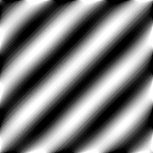

<h1>2D Parallel Fast Fourier Transform</h1>

Fast Fourier Transform is a way to break down a signal into sinusoids which when added up result in the the original signal.

<h2>1D Fourier Transform</h2>

You can place another justified paragraph below the image. This is useful
for documentation where you want a cleaner, book-like layout instead of
ragged-right Markdown text.

<h2>Wrapped Image Example</h2>

This text will wrap around the image on the right side. GitHub still supports
the legacy <code>align="left"</code> attribute for images, which is actually
the most consistent way to achieve this effect in a README.

You can keep writing more text here and it will continue flowing around the image,
similar to how word processors handle text wrapping.
This text will wrap around the image on the right side. GitHub still supports
the legacy <code>align="left"</code> attribute for images, which is actually
the most consistent way to achieve this effect in a README.

You can keep writing more text here and it will continue flowing around the image,
similar to how word processors handle text wrapping.
This text will wrap around the image on the right side. GitHub still supports
the legacy <code>align="left"</code> attribute for images, which is actually
the most consistent way to achieve this effect in a README.

You can keep writing more text here and it will continue flowing around the image,
similar to how word processors handle text wrapping.
This text will wrap around the image on the right side. GitHub still supports
the legacy <code>align="left"</code> attribute for images, which is actually
the most consistent way to achieve this effect in a README.

You can keep writing more text here and it will continue flowing around the image,
similar to how word processors handle text wrapping.
This text will wrap around the image on the right side. GitHub still supports
the legacy <code>align="left"</code> attribute for images, which is actually
the most consistent way to achieve this effect in a README.

You can keep writing more text here and it will continue flowing around the image,
similar to how word processors handle text wrapping.

Once the text is long enough, it will naturally clear below the image.

